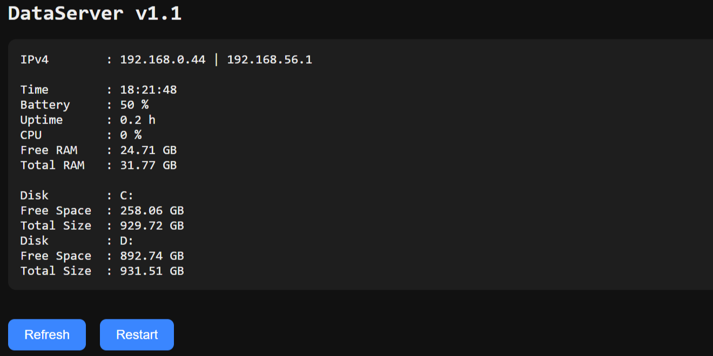

# DataServer

> **Experimental Project**

DataServer is a side project built for the **M5 Cardputer (ESP32)**.
It acts as a USB device that connects to a Windows machine, gathers system information, and hosts that data on a local web server.

This project was created out of curiosity and experimentation with USB HID injection, serial communication, and embedded web servers.

---

## Overview

DataServer works by:

1. Emulating a **USB keyboard (Rubber Ducky-style)**
2. Injecting **Base64-encoded PowerShell commands**
3. Collecting system data from the target machine
4. Sending the data back via **serial (8N1 over USB)**
5. Hosting the collected data on a **local web interface**

---

## ⚠️ Keyboard Layout Injection Warning

During the **keyboard layout and COM port detection phase**, DataServer intentionally sends two different command variants:

* One for **QWERTZ (German layout)**
* One for **QWERTY (US layout)**

Because only one layout can be correct, **at least one of these commands will be interpreted incorrectly**, resulting in **gibberish input** on the target system.

### Potential Risk

* The incorrectly interpreted command may:

  * Execute unintended commands
  * Produce unpredictable behavior
  * Interact with the system in unexpected ways

### Safety Note

* This behavior has been tested with:

  * **German QWERTZ**
  * **US QWERTY**

In these cases, the incorrect command does **not result in harmful or destructive actions**.

However:

> **There is NO guarantee of safety on other keyboard layouts or system configurations.**

---

## How It Works

### 1. COM Port Discovery

To communicate over serial, the device first needs to identify its COM port on the host machine.

* On startup, the ESP32:

  * Listens for **5 seconds** for incoming serial data
* If nothing is received:

  * Injects a qwertz and qwerty version of a PowerShell command
  * Enters **deep sleep for 9 seconds** (disconnects from USB)

During this time:

* PowerShell:

  * Takes a snapshot of available COM ports
* After reconnect:

  * Takes another snapshot
  * Compares both lists
  * Identifies the **new COM port**
  * Sends the port name (e.g. `"COM5"`) back to the device

On reboot:

* The ESP32 simply listens again and receives the COM port string

---

### 2. Keyboard Layout Detection

Because keystroke injection depends on the keyboard layout, the device injects a command that returns the layout in plain text.

* The device sends:

  * A **QWERTZ** version of the command
  * A **QWERTY** version of the command
* The working command responds with:

  * `"qwertz"` or `"qwerty"`

This determines how future commands are injected.

---

### 3. Network Setup

After identifying the layout:

* The device reads WiFi credentials from:

  ```
  SD:\DataServer\creds.txt
  ```
* Connects to the **local LAN**
* Starts a web server

---

### 4. Data Collection

When the user presses **"Refresh"** on the web interface:

* The ESP32:

  * Opens PowerShell via injection
  * Executes a **large Base64-encoded command**
* The Windows machine:

  * Collects system information
  * Sends it back via serial (8N1)
* The ESP32:

  * Receives and displays the data on the website

---

### 5. Access Point Mode

If you press **G0 within 5 seconds** after keyboard layout detection:

* The device:

  * Reads credentials from `creds.txt`
  * Starts its **own WiFi network**
  * Hosts the web interface locally

---

## Web Interface

* Hosted directly from the ESP32
* HTML files are stored on the **SD card**

### Preview



### Features

* 🔄 **Refresh button** → triggers data collection
* 🔁 **Restart button** → restarts the ESP32

---

## File Structure on the ESP32

```
SD:\
└── DataServer\
	├── creds.txt        # WiFi credentials
	└── index.html       # Web interface
```

---

## Disclaimer

This project uses **USB HID injection (Rubber Ducky behavior)**.

* Intended for **educational and experimental purposes only**
* Do **not** use on systems without permission

---

## Why This Exists

This project explores:

* USB HID device emulation
* Serial communication over USB
* PowerShell automation
* Embedded web servers on ESP32

---

## License

No license yet — use at your own risk.
